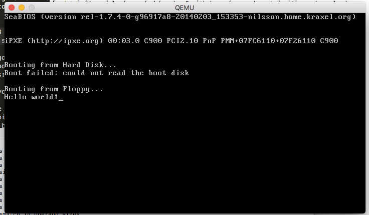
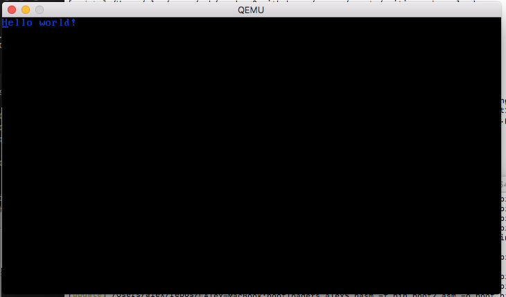
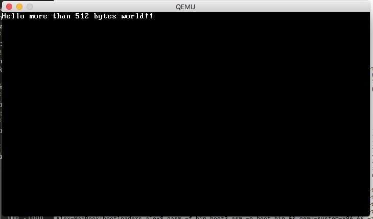
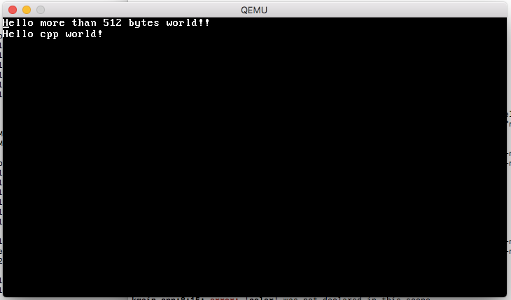

# Bootloader - Part 1
> Simple Bootloader in C

------

This article series explains how to write a tiny 32-bit x86 operating system kernel. We won’t do very much other than print `Hello world!` to the screen in increasingly complicated ways! We’ll start off in assembly and then build up to writing C++!

A [presentation](http://3zanders.co.uk/2017/10/13/writing-a-bootloader/writingabootloader.pdf) of this article series is also available.

To follow along you’re going to need the NASM assembler and [QEMU](https://www.qemu.org/) to emulate a virtual machine for us. QEMU is great because you don’t have to worry about accidentally destroying your hardware with badly written OS code ;) You can install these on [Windows Subsystem for Linux](https://msdn.microsoft.com/en-gb/commandline/wsl/install_guide) or Ubuntu with this command:

```bash
sudo apt-get install nasm qemu
```

On a mac you can use homebrew:

```bash
brew install nasm
```

On Windows 10 you’ll also want to install [an X Server](https://sourceforge.net/projects/xming/) which allows QEMU to open a window from the linux subsystem.


## A Hello World Bootloader

We’re going to write a floppy disk bootloader because it doesn’t require us to mess about with file systems which helps keep things simple as possible.

When you press the power button the computer loads the BIOS from some flash memory stored on the motherboard. The BIOS initializes and self tests the hardware then loads the first 512 bytes into memory from the media device (i.e. the cdrom or floppy disk). If the last two bytes equal `0xAA55` then the BIOS will jump to location `0x7C00` effectively transferring control to the bootloader.

At this point the CPU is running in 16 bit mode, meaning only the 16 bit registers are available. Also since the BIOS only loads the first 512 bytes this means our bootloader code has to stay below that limit, otherwise we’ll hit uninitialised memory!

Let’s get hello world printing to the screen. To do this we’re going to use the ‘Write Character in TTY mode’ [BIOS Interrupt Call](https://en.wikipedia.org/wiki/BIOS_interrupt_call) and the load string byte instruction `lobsb` which loads byte at address `ds:si` into `al`. Here goes:

```nasm
bits 16 ; tell NASM this is 16 bit code
org 0x7c00 ; tell NASM to start outputting stuff at offset 0x7c00
boot:
    mov si,hello ; point si register to hello label memory location
    mov ah,0x0e ; 0x0e means 'Write Character in TTY mode'
.loop:
    lodsb
    or al,al ; is al == 0 ?
    jz halt  ; if (al == 0) jump to halt label
    int 0x10 ; runs BIOS interrupt 0x10 - Video Services
    jmp .loop
halt:
    cli ; clear interrupt flag
    hlt ; halt execution
hello: db "Hello world!",0

times 510 - ($-$$) db 0 ; pad remaining 510 bytes with zeroes
dw 0xaa55 ; magic bootloader magic - marks this 512 byte sector bootable!
```

If you save this file as `boot1.asm` (or [download it here](http://3zanders.co.uk/2017/10/13/writing-a-bootloader/boot1.asm)) we can now use `nasm` to compile it:

```bash
nasm -f bin boot1.asm -o boot1.bin
```

If we run `hexdump boot1.bin` we can see that NASM created some code, padded some zeros then set the final two bytes to the magic number.

```hex
0000000 be 10 7c b4 0e ac 08 c0 74 04 cd 10 eb f7 fa f4
0000010 48 65 6c 6c 6f 20 77 6f 72 6c 64 21 00 00 00 00
0000020 00 00 00 00 00 00 00 00 00 00 00 00 00 00 00 00
*
00001f0 00 00 00 00 00 00 00 00 00 00 00 00 00 00 55 aa
0000200
```

We can now run this thing! You can tell QEMU to boot off a floppy disk using `qemu-system-x86_64 -fda boot1.bin` on Windows 10 you might need to stick `DISPLAY=:0` in front to open the window from WSL. You should get something like this!



------

# Bootloader - Part 2

In our [previous article](http://3zanders.co.uk/2017/10/13/writing-a-bootloader/) we described how to write a bootloader that prints ‘Hello World!’ to the screen in 16bit Real Mode. We’re now going to one up ourselves and print ‘Hello World!’ from 32 bit Protected Mode!

## Entering 32-bit Mode

In our previous article the CPU was still in Real Mode - this means you can call BIOS functions via interrupts, use 16 bit instructions and address up to 1 megabyte of memory (unless you use segment addressing). To access more than 1MB of memory we’re going to enable the [A20 line](http://wiki.osdev.org/A20_Line) by calling the ‘A20-Gate activate’ function. To do this we’ll create a new file called `boot2.asm` and put this in there:

```nasm
bits 16
org 0x7c00

boot:
    mov ax, 0x2401
    int 0x15 ; enable A20 bit
```

Whilst we’re here we’ll also set the VGA text mode to a known value to be safe. Who knows what the BIOS set it to!

```nasm
mov ax, 0x3
int 0x10 ; set vga text mode 3
```

Next we’ll enable 32 bit instructions and access to the full bit 32 registers by entering Protected Mode. To do this we need to set up a [Global Descriptor Table](http://wiki.osdev.org/GDT) which will define a 32 bit code segment, load it with the `lgdt` instruction then do a long jump to that code segment.

```nasm
lgdt [gdt_pointer] ; load the gdt table
mov eax, cr0 
or eax,0x1 ; set the protected mode bit on special CPU reg cr0
mov cr0, eax
jmp CODE_SEG:boot2 ; long jump to the code segment
```


## Global Descriptor Table

The GDT we’re going to set up involves 3 parts: a null segment, a code segment and a data segment. The structure of each GDT entry looks like this:


Here’s what the fields mean:

-   **base** a 32 bit value describing where the segment begins
-   **limit** a 20 bit value describing where the segment ends, can be multiplied by 4096 if **granularity** = 1
-   **present** must be 1 for the entry to be valid
-   **ring level** an int between 0-3 indicating the kernel [Ring Level](http://wiki.osdev.org/Security#Rings)
-   **direction**
    -   0 = segment grows up from base, 1 = segment grows down for a data segment
    -   0 = can only execute from ring level, 1 = prevent jumping to higher ring levels
-   **read/write** if you can read/write to this segment
-   **accessed** if the CPU has accessed this segment
-   **granularity** 0 = limit is in 1 byte blocks, 1 = limit is multiples of 4KB blocks
-   **size** 0 = 16 bit mode, 1 = 32 bit protected mode

We’ll define this directly in assembly:

```nasm
gdt_start:
    dq 0x0
gdt_code:
    dw 0xFFFF
    dw 0x0
    db 0x0
    db 10011010b
    db 11001111b
    db 0x0
gdt_data:
    dw 0xFFFF
    dw 0x0
    db 0x0
    db 10010010b
    db 11001111b
    db 0x0
gdt_end:
```

To actually load this we also need a gdt pointer structure. This is a 16 bit field containing the GDT size followed by a 32 bit pointer to the structure itself. We’ll also define the `CODE_SEG` and `DATA_SEG` value which are offsets into the gdt for use later:

```nasm
gdt_pointer:
    dw gdt_end - gdt_start
    dd gdt_start
CODE_SEG equ gdt_code - gdt_start
DATA_SEG equ gdt_data - gdt_start
```

At this point we have enough to get into 32-bit mode! Let’s tell nasm to output 32 bit now. We’ll also set the remaining segments to point at the data segment.

```nasm
bits 32
boot2:
    mov ax, DATA_SEG
    mov ds, ax
    mov es, ax
    mov fs, ax
    mov gs, ax
    mov ss, ax
```

### Writing to the VGA Text Buffer

Finally let’s write ‘Hello world!’ to the screen from Protected Mode! We can’t call the BIOS any more but we can write to the [VGA text buffer](https://en.wikipedia.org/wiki/VGA-compatible_text_mode) directly. This is memory mapped to location `0xb8000`. Each character on screen has this layout:


The top byte defines the [character colour](https://en.wikipedia.org/wiki/Video_Graphics_Array#Color_palette) in the buffer as an int value from 0-15 with 0 = black, 1 = blue and 15 = white. The bottom byte defines an [ASCII](http://www.asciitable.com/) code point. Using this information we can write some assembly that writes ‘Hello World’ in blue text:

```nasm
    mov esi,hello
    mov ebx,0xb8000
.loop:
    lodsb
    or al,al
    jz halt
    or eax,0x0100
    mov word [ebx], ax
    add ebx,2
    jmp .loop
halt:
    cli
    hlt
hello: db "Hello world!",0
```

## Let’s run the thing!

We finally have everything! Save the whole thing as a `boot2.asm` file ([source available here](http://3zanders.co.uk/2017/10/13/writing-a-bootloader/boot2.asm)) then run it with `nasm -f bin boot2.asm && qemu-system-x86_64 -fda boot.bin`. You should get something like this!



------

# Bootloader - Part 3

In our [previous article](http://3zanders.co.uk/2017/10/16/writing-a-bootloader2/) we got our CPU into 32-bit protected mode and printed the screen using the directly mapped VGA memory. This time we’re going to compile and load a C++ function into memory and call it!

## Going beyond 512 bytes

The BIOS only loads the first 512 bytes of the bootsector. If we want to write programs larger than 512 bytes (maybe you don’t want to and like a challenge?) we’re going to have to load more off the disk. To do this we’re going to use the `int 0x13` [interrupts](https://en.wikipedia.org/wiki/INT_13H) which provide disk services.

The `ah=0x2 int 0x13` command reads sectors from a drive to a target location, like this:

```nasm
mov ah, 0x2    ;read sectors
mov al, 1      ;sectors to read
mov ch, 0      ;cylinder idx
mov dh, 0      ;head idx
mov cl, 2      ;sector idx
mov dl, [disk] ;disk idx
mov bx, copy_target;target pointer
int 0x13
```

The disk number is implicitly placed into `dl` by the BIOS on startup. Earlier on we stashed it into memory with `mov [disk], dl`.

So we can now load 512 bytes from the second sector into memory! Let’s make use of that and move the hello world printing code from [last time](http://3zanders.co.uk/2017/10/13/writing-a-bootloader/boot2.asm) beyond the first 512 bytes of disk. Like this:

```nasm
times 510 - ($-$$) db 0
dw 0xaa55
copy_target:
bits 32
    hello: db "Hello more than 512 bytes world!!",0
boot2:
    mov esi,hello
    mov ebx,0xb8000
.loop:
    lodsb
    or al,al
    jz halt
    or eax,0x0F00
    mov word [ebx], ax
    add ebx,2
    jmp .loop
halt:
    cli
    hlt
times 1024 - ($-$$) db 0
```

The last line pads our bootloader to 1024 bytes so we’re not copying uninitialised bytes from disk. It’s probably easiest to download [boot3.asm](http://3zanders.co.uk/2017/10/13/writing-a-bootloader/boot3.asm) directly. You can compile and run it with `nasm -f bin boot3.asm -o boot.bin && qemu-system-x86_64 -fda boot.bin` getting this result:



## Getting to C++

Next we’re going to load a C++ function that prints Hello world into memory and then call it from the bootloader. Here is the C++ function we want to compile:

```cpp
extern "C" void kmain()
{
    const short color = 0x0F00;
    const char* hello = "Hello cpp world!";
    short* vga = (short*)0xb8000;
    for (int i = 0; i<16;++i)
        vga[i+80] = color | hello[i];
}
```

I’ve intentionally kept the function as simple as possible - it does almost the same thing as the assembly code. The `extern "C"` prevents C++ from [name mangling](https://en.wikipedia.org/wiki/Name_mangling#C.2B.2B) the function allowing us to call it from assembly.

## Compiling and Linking

We now need to compile and link this function. To do this safely we need to create a [cross compiler](https://en.wikipedia.org/wiki/Cross_compiler) - this is safer than using your system’s C++ compiler since we can be certain about what instruction set and function call method the compiler uses. I also can’t for the life of me convince clang to use a linker script and stop adding loads of OSX specific stuff. Since we’re building a 32 bit operating system we also want the compiler to output 32 bit instructions - not 64 bit ones!

Compiling a cross compiler is an absolute pain - but luckily I’ve hacked a [homebrew tap](https://github.com/zanders3/homebrew-gcc_cross_compilers) you can use:

```bash
brew tap zanders3/homebrew-gcc_cross_compilers
brew install --debug i386-elf-gcc
```

Interestingly upgrading Mac OSX can mess gcc and all sorts of things up so try these commands if things fall over.

```bash
xcode-select --install
brew reinstall gcc
```

This will install `i386-elf-_g++` on your path which will compile and link stuff for us! Installing takes a while - you might want to grab a cuppa whilst it compiles.

## Linker Script

We need to tell gcc how to link our cpp file and asm files together. We want the `boot4.asm` code positioned at offset `0x7c00` so that the 510th bytes equal `0xAA55` which makes it a valid bootsector. We then want all of the C++ code placed after that in the file.

```nasm
ENTRY(boot)
OUTPUT_FORMAT("binary")
SECTIONS {
    . = 0x7c00;
    .text :
    {
        *(.boot)
        *(.text)
    }
    .rodata :
    {
        *(.rodata)
    }
    .data :
    {
        *(.data)
    }
    .bss :
    {
        *(.bss)
    }
}
```

The `ENTRY(boot)` means the entry point of the program is the `boot` symbol. `OUTPUT_FORMAT("binary")` tells `gcc` to output raw assembly directly. It will otherwise output a binary file in [ELF](https://en.wikipedia.org/wiki/Executable_and_Linkable_Format). The `. = 0x7c00` tells it to start outputting code at that offset, similar to the `org 0x7c00` command.

## Calling C++ from Assembly

Next we need to modify our assembly so it can be linked with `gcc`. First we’re going to put everything in the `.boot` section so it’s placed first as well as define a global `boot:` symbol so the linker knows about the entry point.

```nasm
section .boot
bits 16
global boot
boot:
```

Next we’ll hack the disk reading function call to load more than one sector:

```nasm
mov al, 6      ;sectors to read
```

Finally we set up a call stack for C++ to use and call the actual function. We reserve 16 KB for a kernel call stack.

```nasm
mov esp,kernel_stack_top
extern kmain
call kmain
cli
hlt
section .bss
align 4
kernel_stack_bottom: equ $
    resb 16384 ; 16 KB
kernel_stack_top:
```

That’s it. We’re ready to compile and run this thing! Here are my versions of [the linker script](http://3zanders.co.uk/2017/10/13/writing-a-bootloader/linker.ld), [cpp file](http://3zanders.co.uk/2017/10/13/writing-a-bootloader/kmain.cpp) and [bootsector assembly](http://3zanders.co.uk/2017/10/13/writing-a-bootloader/boot4.asm)!


## Compiling and Running

You want to compile the assembly, then link it all together.

```bash
nasm -f elf32 boot4.asm -o boot4.o
i386-elf-_g++ x86_64-elf-g++ -m64 kmain.cpp boot4.o -o kernel.bin -nostdlib -ffreestanding -std=c++11 -mno-red-zone -fno-exceptions -nostdlib -fno-rtti -Wall -Wextra -Werror -T linker.ld
```

We can run `hexdump kernel.bin` to check it did the right thing:

```hex
0000000 b8 01 24 cd 15 b8 03 00 cd 10 88 16 61 7c b4 02
0000010 b0 06 b5 00 b6 00 b1 02 8a 16 61 7c bb 00 7e cd
0000020 13 fa 0f 01 16 5b 7c 0f 20 c0 66 83 c8 01 0f 22
0000030 c0 b8 10 00 8e d8 8e c0 8e e0 8e e8 8e d0 ea 22
0000040 7e 08 00 00 00 00 00 00 00 00 00 ff ff 00 00 00
0000050 9a cf 00 ff ff 00 00 00 92 cf 00 18 00 43 7c 00
0000060 00 00 00 00 00 00 00 00 00 00 00 00 00 00 00 00
*
00001f0 00 00 00 00 00 00 00 00 00 00 00 00 00 00 55 aa
0000200 48 65 6c 6c 6f 20 6d 6f 72 65 20 74 68 61 6e 20
0000210 35 31 32 20 62 79 74 65 73 20 77 6f 72 6c 64 21
0000220 21 00 be 00 7e 00 00 bb 00 80 0b 00 ac 08 c0 74
0000230 0d 0d 00 0f 00 00 66 89 03 83 c3 02 eb ee bc f8
0000240 be 00 00 e8 02 00 00 00 fa f4 55 48 89 e5 48 83
0000250 ec 20 c7 45 f8 00 0f 00 00 48 c7 45 f0 ad 7e 00
0000260 00 48 c7 45 e8 00 80 0b 00 c7 45 fc 00 00 00 00
0000270 83 7d fc 0f 7f 34 8b 45 fc 48 63 d0 48 8b 45 f0
0000280 48 01 d0 0f b6 00 66 98 80 cc 0f 89 c2 8b 45 fc
0000290 48 98 48 83 c0 50 48 8d 0c 00 48 8b 45 e8 48 01
00002a0 c8 66 89 10 83 45 fc 01 eb c6 90 c9 c3 48 65 6c
00002b0 6c 6f 20 63 70 70 20 77 6f 72 6c 64 21 00 00 00
00002c0 14 00 00 00 00 00 00 00 01 7a 52 00 01 78 10 01
00002d0 1b 0c 07 08 90 01 00 00 1c 00 00 00 1c 00 00 00
00002e0 6a ff ff ff 63 00 00 00 00 41 0e 10 86 02 43 0d
00002f0 06 02 5e c6 0c 07 08 00                        
00002f8
```

Note the `55 aa` there near offset `0x200`? That means it’s a valid bootsector! Let’s try running it with `qemu-system-x86_64 -fda kernel.bin` and you should get this result.



-----